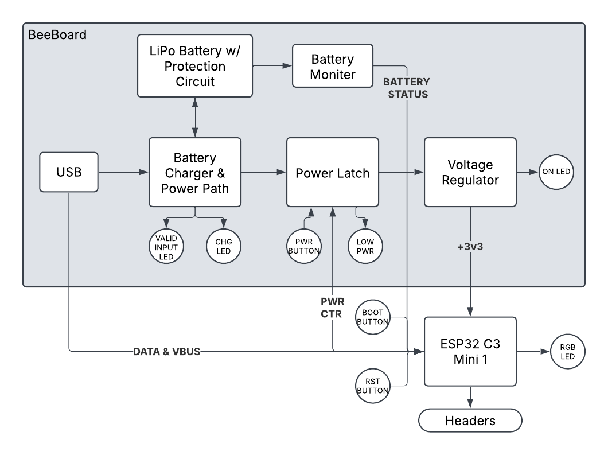
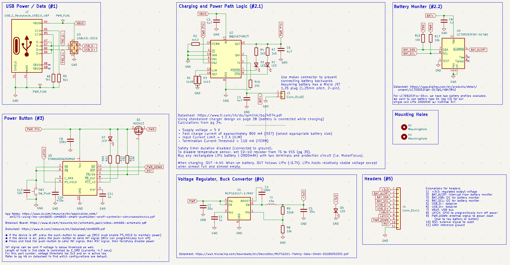
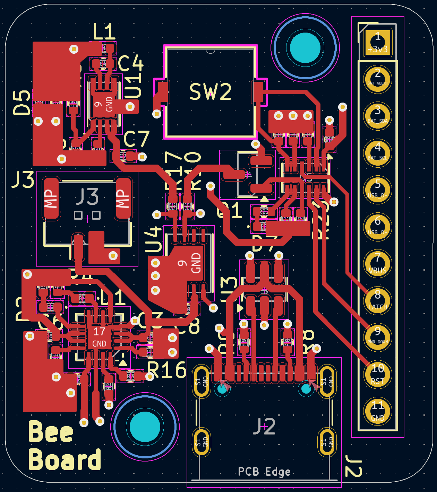
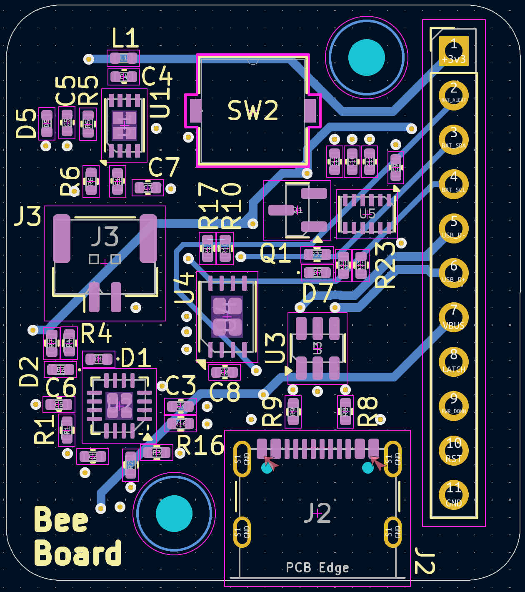
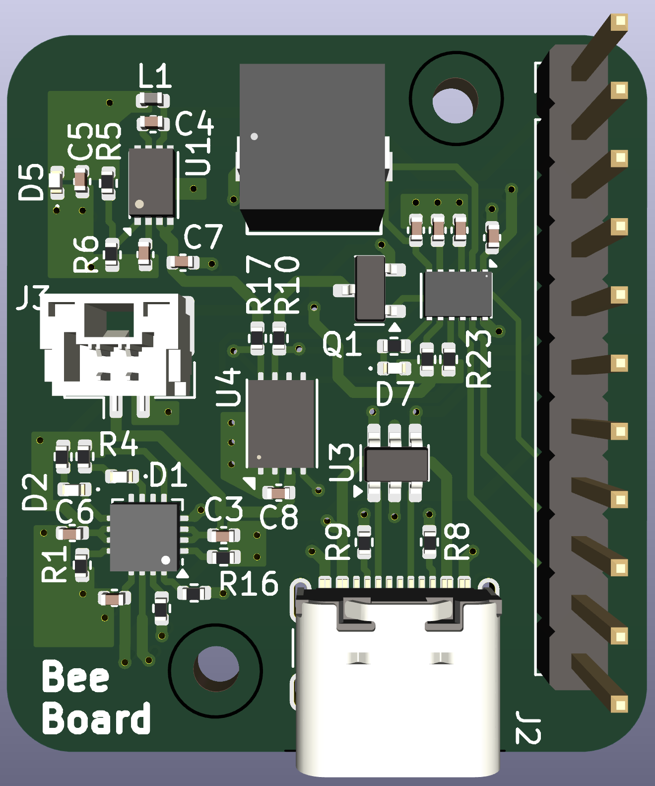
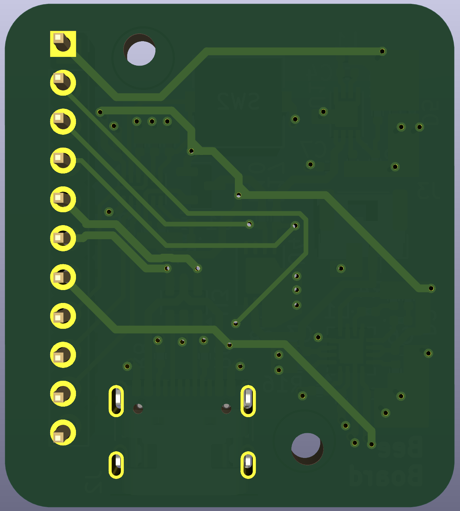

# Overview

This repo contains a generic power supply for ESP32 and other MCUs. This board includes: 

1) Charging circuit with power path
2) Smart power button (for manually/programmtically controlling power)
3) Battery status  

The purpose of this board is to make an MCU portable with precise battery control and monitoring.

## Block diagram

## Schematic

## PCB

## 3D Model

